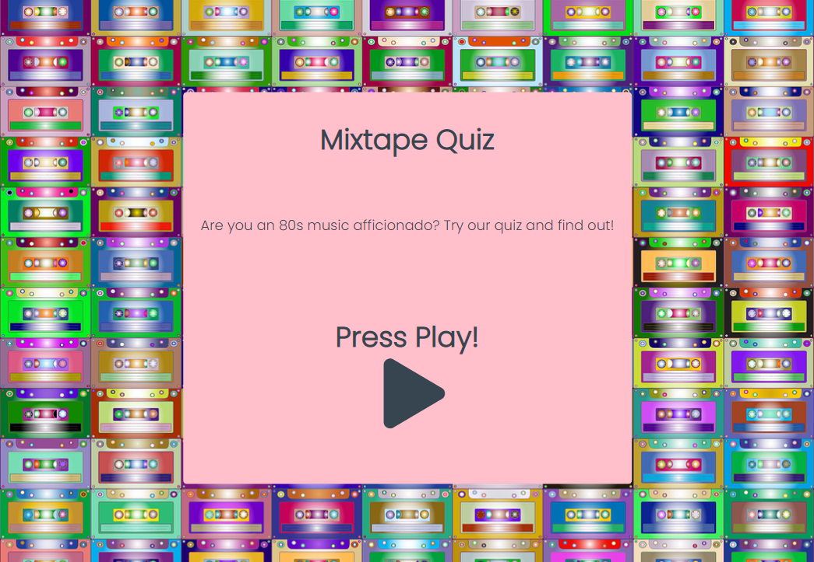
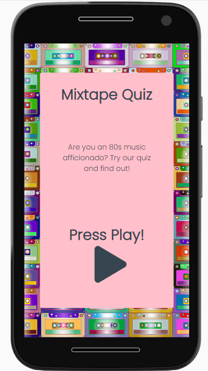
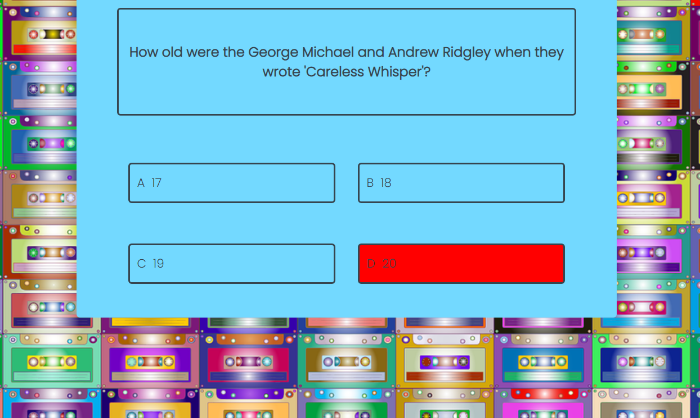
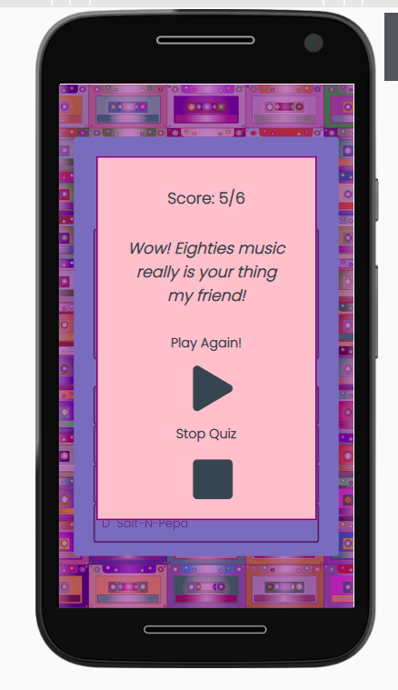

# Mixtape Quix

- [Mixtape Quix](#mixtape-quix)
  * [Introduction](#introduction)
  * [User Experience (UX)](#user-experience--ux-)
    + [Target Audience](#target-audience)
    + [Strategy](#strategy)
    + [Scope](#scope)
      - [User Stories](#user-stories)
    + [Structure](#structure)
    + [Skeleton](#skeleton)
      - [Wireframes](#wireframes)
    + [Surface](#surface)
    + [Features](#features)
      - [Existing Features](#existing-features)
      - [Future Features](#future-features)
    + [Languages Used](#languages-used)
    + [Technologies Used](#technologies-used)
  * [Testing](#testing)
    + [Validator Testing](#validator-testing)
    + [Responsiveness](#responsiveness)
    + [User Stories Testing](#user-stories-testing)
    + [Manual Testing](#manual-testing)
    + [Bugs](#bugs)
    + [Unfixed Bugs](#unfixed-bugs)
  * [Deployment](#deployment)
  * [Cloning the repository](#cloning-the-repository)
  * [Credits](#credits)
    + [Content](#content)
    + [Code](#code)
    + [Media](#media)

[The live website can be viewed here](https://siobhanlgorman.github.io/80s-Mixtape-Quiz/)
## Introduction
The Mixtape quiz is a fun interactive quiz for people who love the music of the eighties. Users answer multiple choice questions and are rated on their final score. 

## Goal
The goal is to create an entertaining web-based music trivia quiz. I picked eighties music because it's an era that I like myself and also it has undergone a revival and so will interest a range of age groups. 

## User Experience (UX)
### Target Audience
The quiz targets people of all ages who enjoy quizzes and are specifically interested in music of the eighties.

### Strategy 
The purpose of this online quiz is to provide an entertaining online quiz for people of all ages who like 80s music. 

The quiz should be easy for the user to navigate across the different pages and return to the home page or restart the quiz. 

The application should initially be a simple design with enough interactivity to function and entertain and to which features and question content can easily be added as popularity grows.  

### Scope
The project scope follows the minimal viable features approach for the initial project. However the scope is such that interactive features to enhance the user experience will be added in future. 

The project is to be a simple functioning online quiz game with randomly generated multiple choice questions. The score will accumulate up to a specified maximum which can be adjusted according to the number of questions available. Initially this will be set to six as the test pool of questions is relatively small but sufficient for the user to enjoy the experience. 

A fun feedback message will be generated to rate the user's final score.

The purpose of the site will be clear from the landing page and will be visually attractive to the user. The site will be easy to navigate and fully responsive to all sized screens. 

#### User Stories
As the site owner I want to:
* create an entertaining interactive quiz on the topic of eighties music trivia

As a general user I want to:
1. play a fun quiz
2. navigate easily around the application
3. easily see what question number I am on
4. answer challenging questions on the topic
5. easily see if my answer is right or wrong
6. view my final score
7. easily restart the game after I finish
8. be rated on my knowledge of the subject
9. be able to use the application on different sized screens

As a new user I want to 
* easily see what the quiz topic is

During this phase of the project design test repositories were created to try out visuals and initial features before establishing the final respository.

### Structure

The user experience design is clear and simple with features positioned conventionally. Navigation items are clearly visible on each page signalling the pathway through the site from the home page through the quiz ending at the modal. From there the user can navigate back to the home page or to the quiz start page. 

Home Page
* Title: the title of the quiz appears on the home page to announce the topic of the quiz. 
* There is one clear call to action button to start the quiz.

Quiz Page
* The question is clearly visible in the middle of the quiz play area with the four answer choices underneath. For the smaller screens the answers display on a single column.
* Above the question?answers is the counter section showing the accumulating number of correct answers and the current question number out of the maimum available questions. Also here is a clear button to stop the quiz and return to the home page.
* When the user selects the answer the colour of the answer changes to red or green to indicate correct or incorrect before displaying the next question.

Modal
* When the maximum number of questions is reached the quiz ends and a modal pops up to display the final score and a fun message to rate the user's performance.
* The modal offers a choice of actions to the user: end the quiz and return to the home page or restart the quiz.

### Skeleton

The site is designed around the theme of a mixtape, popular in the eighties. The navigation icons are therefore designed to reflect the buttons on a cassette player i.e. the play triangle and the square stop buttons. The functions of these icons are still universally understood so will be clear to users. The navigation icons are prominently displayed on the pages allowing an clear flow through the application from the home page to the quiz page ending on the modal and then returning to either the quiz or the home page. 

All text areas are contained in boxes and are centred on the screen for a positive user experience.

#### Wireframes
The initial wireframe designs for this application can be seen here:

[Wireframes](https://github.com/siobhanlgorman/80s-Mixtape-Quiz/tree/master/wireframes)

### Surface

* Theme

The theme of the application is of a mixtape which was popular way to assemble a mixture of recorded music on a cassette tape in the eighties. All of the design reflects this theme. 

* Background Image

The background image is of attractive brightly coloured cassette tapes to reflect both the cassette tape theme and the colours popular in this decade.

* Favicon
A small image of a cassette tape was used as a favicon

* Icons
The icons used for navigation were chosen to resemble the navigation buttons on a cassette player i.e. the triangle for play to start the quiz and the square for stop to stop the quiz and return to the home page.

* Colours
The colours of the site were chosen to tone with the eighties colours of the background image, purples and turquoise (particular favourites of the site author in the eighties!). The background colour of the home page, play area and modal were kept pale to provide enough contrast against the text yet still evoke the colour scheme of the era.

* Font Colour
The font colour used was charcoal #36454F as it is more gentle on the eye than black.

* Font
The font selected was Poppins as it has a pleasing rounded look to the user, is clear and legible.

### Features
## Existing Features

* Home page
Play button to navigate to quiz page

* Quiz page
Score Counter

Question number indicator

Stop button - ends quiz by navigating back to home page

Answers turn either red for incorrect answer or green for correct

* Modal
final score

Special message

Play again 
button - closes modal and restarts quiz
Stop button - navigates to home page

The mouse changes to a pointer to indicate clearly where the user can click for an action.

## Future Features

Future features to add to improve the user interface would be:
* In order to add features first the question pool would have to be increased and a function added to ensure that questions were not repeated within the play period of the user (currently they are not repeated within the one set of questions)
* the types of questions could be broadened to be target a wider variety of users with as the eighties covers a wide range of music genres
* The ability to save the user name and high scores so the user could return to the quiz to beat their own scores. 
* Currently the questions are all text-based but expanding to include visual questions with pictures would inrease enjoyment for the user.
* An audio sound on completion of the game would also enhance experience.
* Given sufficient questions, a list of questions answered correctly and incorrectly could be generated at the end of the quiz.
* A navigation menu would be added to the home page along with the future features above to enable the user to directly access their high scores and for a new user to view a rules/instructions page

### Languages Used
* HTML (Hypertext Markup Language) was used to design the basic website.
* CSS (Cascading Style Sheets) to style the website and make it look more appealing to the user.
* Javascript was used to provide interactivity to the application.

### Technologies Used

Git was used for version control

[Balsamiq](https://balsamiq.com/) was used to create the wireframes.

[Google Fonts](https://fonts.google.com) was used for the font: Poppins

[Fontawesome](https://fontawesome.com) was used for the social media icons, map link and the arrow back to top.

[Picresize](https://picresize.com) and [Squoosh](https://squoosh.app/) were used to resize the photo used for the background

For the 80s colours palette - purple, pink, and turquoise tones [Adobe Colour Wheel](https://color.adobe.com/create/color-wheel) was used.

* [HTML Validator](https://validator.w3.org/)
* [CSS Validator](https://validator.w3.org/)
* [JS Hint](https://jshint.com/)

## Testing
### Validator Testing
* [HTML Validator](https://validator.w3.org/) was run at several points during the project and small syntax errors identified were fixed. At the final stage no errors or warnings were found
* [CSS Validator](https://validator.w3.org/) was run several times during the project and picked up small syntax errors which were corrected. At the time of submission the css code successfully passed the validator with no errors.
* [JS Hint](https://jshint.com/) was used to check the two javascript files. One unused variable refers to the variable questions which is declared in the quiz questions file.
* Chrome Developer Tools was used in responsiveness design and extensively in debugging javascript functions. 
* Lighthouse in Chrome Developer Tools was used to check performance and picked up some early contrast errors in colour choice so colours were adjusted accordingly. Lighthouse indicated that the background image was large for the site so this was resized without impacting quality and fixed this warning. An apple touch icon and link was also added to fix this issue. No other significant errors were found. 

### Responsiveness
The website was tested on Chrome, Mozilla, Edge and Safari browsers with no problems found and good performance. However performance was poor on Internet Explorer

The website was tested on numerous sized screens including Iphones 8 and X, Moto G8 plus, 15" laptop, 24" screen and Ipad and was found to respond as expected to all sizes.
Chrome developer tools were used throughout the design process to check responsiveness and breakpoints. Adjustments were made accordingly. Final testing was done on physical devices as they are the most reliable test.

### User Stories Testing

Each user story was tested as follows:
As the site owner I want to:
* create an entertaining interactive quiz on the topic of eighties music trivia

The quiz was tested by a variety of friends and family who appreciated the look of the quiz and enjoyed playing it. They found it to be fun and would like more questions to be added to play more times.

As a general user I want to:
* play a fun quiz
The welcome page with its brightly coloured image of cassettes inspires a positive emotional reponse in users and they anticipate a fun quiz. The title is prominent and clearly shows the topic of the quiz. THe theme is comprehensively supported by the image and colours. The large play call to action button invites users to start the quiz. 

* navigate easily around the application
Navigation buttons are clearly displayed on each page. The icons are styled in keeping with the cassette theme and are minimal which keeps the user flow through the site clear. On the home page there is one call to action button prominently displayed which links to the quiz page and invites the user to start the quiz.

At the top of the quiz page there is a button to stop the quiz and return to the home page.

On the modal page there are two prominent navigation buttons offering the user a choice of playing again or ending and returning to the home page.

* easily see what question number I am on

At the top of the quiz play area there is a question number section showing the current question number and the total to be asked.

* answer challenging questions on the topic

The question collection features a variety of questions which test a wide range of musical knowledge from different genres of the eighties.

* easily see if my answer is right or wrong

The answer box turns red if the user clicks a wrong answer and green if it is correct.

* view my final score
At the end of the quiz a modal pops up which displays the user's final score

* easily restart the game after I finish

The modal offers the user the opportunity to restart the quiz

* be rated on my knowledge of the subject
When the quiz ends the modal pops up and displays a fun message rating the user's knowledge on the topic according to their final score.

* be able to use the application on different sized screens
The image responds to different screen sizes with the game play area and modal in a central position and the answer choices moving from 2 rows on a large and medium screen to one column on smaller screens.

As a new user I want to 
* easily see what the quiz topic is
The quiz title and topic are clearly displayed on the landing page

### Manual Testing
The quiz was tested by users of various ages. Feedback was overall positive from users. The following constructive feedback was used to make improvements. 
* One user reported that the reponse to the user click on the answer was too laggy so the timeout delay for the removal of colour change was reduced from 1.5 seconds to 1 second.
* A link 'x' with a function to close the modal was removed for the final version it became superflous after a stop quiz and play again buttons were added and no other option is available to close the modal.

The following links were tested and functioned as expected:
* The play button on the home page links to the quiz page
* The stop button on quiz page exits the quiz and returns the user to the home page
* the 'Play Again' button on the modal page returns the user to the start of the quiz with a new question.
* The Stop button on the modal returns the user to the home page.

The following were also tested and function correctly:
* The modal page pops up at the end of the quiz as expected, correctly displaying the final score and the message corresponding to the final score. 
* the colours change to the colour correspnding to the answer selected by the user.

### Bugs
The following bugs wer found and squashed: 
1. Despite the default setting of the modal to not display , the modal diplayed automatically over the quiz page when viewed in the deployed site in Chrome although not in the browser. After examination in Chrome developer tools it was discovered that the semantic container 'section' was causing the override to 'display: block'. When section was replaced by 'div' the problem was removed. 'Div' was then replaced by aside as a more appropriate semantic description for the modal and this also worked perfectly.
2. It was discovered in testing that clicking on the answer box sometimes produced no response in colour change. This was at first thought to be a 'laggy' response. However on closer examination through Chrome Developer tools the 
answer text was found to be smaller than the width of the container in many cases resulting in the click having to be on the exact text to produce a response. This was corrected by assigning a width of 100% to the text content.
3. In the final testing stages it was observed that when hovering over the 'play again' button and text in the modal the cursor did not change to a pointer. Initial examination of the css code highlighted an issue with class and id assignments. However these corrections resulted in the function to restart the game only working for the icon and not the text. One solution was to duplicate the onclick function for the text worked but this resulted in cumbersome javascript. The final cleaner solution was to apply a query selector to both elements and then loop through this array and apply an eventlistener for the click to both.

### Unfixed Bugs
There are no known outstanding bugs.
## Deployment
The site was deployed to GitHub pages. The steps taken to deploy are as follows:
1. Log in to [Github](https://github.com/)
2. Navigate to [siobhanlgorman/80s-Mixtape-Quiz](https://github.com/siobhanlgorman/80s-Mixtape-Quiz) in the list of repositories
3. In the GitHub repository, navigate to the [Settings](https://github.com/siobhanlgorman/80s-Mixtape-Quiz/settings) tab
4. In Settings scroll down to [GitHub pages](https://github.com/siobhanlgorman/80s-Mixtape-Quiz/settings/pages) which opens in a new page.
5. From the source section drop-down menu, select the Master Branch
6. Once the master branch has been selected, the page is automatically refreshed and a display indicates the successful deployment and the link to the address.
The link to the live website is here:
[80s-Mixtape-Quiz](https://siobhanlgorman.github.io/80s-Mixtape-Quiz/index.html)

## Cloning the repository to run locally
1. On Github navigate to the main page of the repository
2. Above the list of files click the dropdown code menu
3. Select the https option and copy the link
4. Open the GitPod Bash terminal
5. Change the current working directory to the desired destination location
6. Type the Git clone command and then paste the copied URL
7. Press enter to create the local clone

## Credits
### Content
Most questions were written by this author with inspiration and some questions adapted from the following sites:

* [Zoo](https://www.zoo.com/quiz/can-you-guess-80s-songs-their-opening-lyrics-quiz) 
* [Cambridge News](https://www.cambridge-news.co.uk/news/uk-world-news/80s-music-quiz-questions-test-18213733)
* [The Express](https://www.express.co.uk/entertainment/music/1290366/80s-music-quiz-questions-and-answers)
* [Smooth Radio](https://www.smoothradio.com/quizzes/1980s-music-trivia-quiz/)

### Code
* This tutorial by [James Q Quick - Build A Quiz App](https://www.youtube.com/watch?v=rFWbAj40JrQ) was followed closely for the intial javascript set up of random question and answers generation. It was adapted from James' code to better suit this particular design.

The following tutorial was also useful as a guide and is very similar to the above
* [How to Make a Quiz App using HTML CSS Javascript - Vanilla Javascript Project for Beginners Tutorial](https://www.youtube.com/watch?v=f4fB9Xg2JEY)

The following references were used as learning resources

* On how to use data attributes (https://developer.mozilla.org/en-US/docs/Learn/HTML/Howto/Use_data_attributes)
* [Reference on forEach looping syntax](https://developer.mozilla.org/en-US/docs/Web/JavaScript/Reference/Global_Objects/Array/forEach)
* Timeout function https://www.w3schools.com/jsref/tryit.asp?filename=tryjsref_win_settimeout
* Designing a modal: [How to make a modal](https://www.youtube.com/watch?v=6ophW7Ask_0); (https://www.w3schools.com/howto/howto_css_modals.asp)

The following were used as references to check syntax for coding and for general queries:

[w3 schools](https://www.w3schools.com/)
[stackoverflow](https://stackoverflow.com/)

### Media
* Images
From [Pixabay](https://pixabay.com/):
* [Cassettes image](cassette-5986249_1280.jpg) for the background image.  Image by <a href="https://pixabay.com/users/gdj-1086657/?utm_source=link-attribution&amp;utm_medium=referral&amp;utm_campaign=image&amp;utm_content=5986249">Gordon Johnson</a> from <a href="https://pixabay.com/?utm_source=link-attribution&amp;utm_medium=referral&amp;utm_campaign=image&amp;utm_content=5986249">Pixabay</a>
* [cassette icon](https://icons8.com/icons/set/cassette) from [Icons8](http://www.Icons8.com) for the favicon